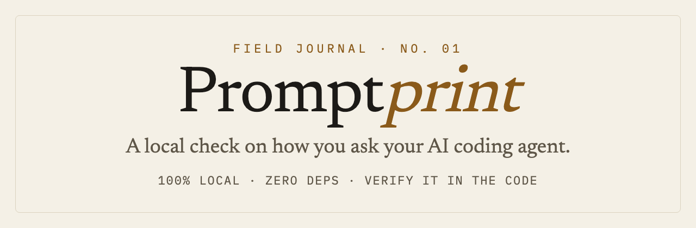
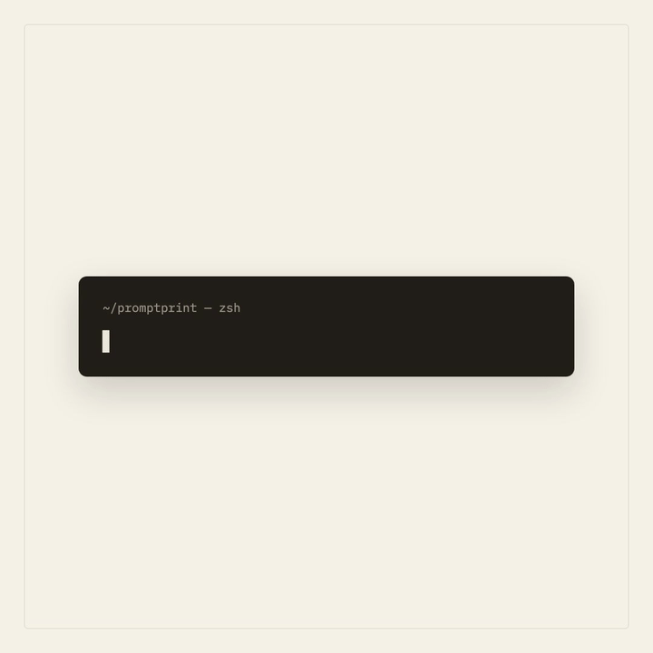

<div align="center">

<a href="https://sh-ryu.com/promptprint/"></a>

**English** · [한국어](README.ko.md)

[](https://github.com/shryu1994/promptprint/actions/workflows/ci.yml)
[](LICENSE)
[](#️-how-it-works)
[](#-verify-it-yourself)
[](https://github.com/shryu1994/promptprint/stargazers)

*Your AI coding agent gets the credit. Promptprint shows how good* **you** *got at asking — and what to fix next.*

[**▶ Live demo report**](https://sh-ryu.com/promptprint/) · [GitHub](https://github.com/shryu1994) · [X / Twitter](https://x.com/shryu1994) · [sh-ryu.com](https://sh-ryu.com)

</div>

---

Promptprint reads the **questions you've sent your AI coding agents** (Claude Code, Codex), 100% on your own machine, and measures the one thing nothing else does: **how *you* ask — and how that's changing.**

Every other tool measures your *agent* — tokens, cost, lines accepted. This is a **recurring check** on your questioning skill that ends with *what to change next*, not a number to feel good about. It's open source and offline by design, so *"your data never leaves your computer"* is something you can **verify in the code** — not take on trust.

> **MIT · standard library only · zero network.** `bash verify.sh` exits `0` only if there are no network-capable imports.

<div align="center">

[](https://sh-ryu.com/promptprint/)

**▶ [See the live demo report →](https://sh-ryu.com/promptprint/)** — built from 100% synthetic data, no real prompts.

</div>

## Install

In Claude Code (or Codex) — nothing else to set up:

```
/plugin marketplace add shryu1994/promptprint
/plugin install promptprint@promptprint
/promptprint:promptprint
```

The skill runs the bundled Python (standard library only); **your own agent does the interpretation** — no separate model, no API key.

<details>
<summary>📖 <b>Contents</b></summary>

- [🎯 What you get](#-what-you-get)
- [⚙️ How it works](#️-how-it-works)
- [🔒 Verify it yourself](#-verify-it-yourself)
- [🙅 What this can't tell you](#-what-this-cant-tell-you)
- [🛡️ Privacy](#️-privacy)
- [🔌 Supported tools](#-supported-tools)
- [🤝 Connect](#-connect)

</details>

## 🎯 What you get

**A recurring check — the one you actually re-run.** `/promptprint check` compares your last 30 days to the 30 before: what moved in *how you ask* (verifying more? directing more? fewer round-trips per task?), what new ground you're on, and — most useful — **the repeated work you keep re-explaining, ready to turn into a skill** instead of pasting it again. Length-robust rates, not flattering raw counts.

**A growth report** — a single self-contained HTML field journal (+ shareable cards), in your own language. It opens with **what to do next** — next bearings, and skills to create from the repeated work in your logs (each with a ready-to-paste `/skill-creator` seed and an *honest, measured* saving estimate) — then the retrospective, across six dimensions:

| Dimension | What it captures |
|---|---|
| **Topic evolution** | What you ask *about*, and how that ground shifts and deepens |
| **Depth** | "How do I…" (procedure) → "Why is this better…" (principles and trade-offs) |
| **AI meta-skill** | Dictating → directing and verifying: how you *handle* the AI matures |
| **Craft** | Context, constraints, multi-step prompts — fewer round-trips per intent |
| **Mastery** | Topics you once asked about intensely, then *graduated* from |
| **Your phases** | Clusters the tool finds in your data — your own seasons of work |

It also surfaces two things you can **share without oversharing**: your **session shape** (round-trips per task, one-shot rate — the numbers you can actually move) and a **question-genre mix** (debug / build / understand / improve) — the texture of *what* you ask, in counts, never raw text.

## ⚙️ How it works

Five layers, all on your machine:

1. **Logs** — read your questions from `~/.claude` and `~/.codex` (read-only).
2. **Adapters** — normalize each tool's format into one common schema.
3. **Aggregate** — deterministic Python statistics: no LLM, same input → same numbers.
4. **Interpret** — your host agent reads the aggregates plus a small sample (never the full transcript) and writes the story.
5. **Render** — a single self-contained HTML report and a few shareable cards.

Two ideas keep it trustworthy: a **deterministic skeleton** (plain Python numbers that don't change between runs) with **LLM narration** on top, and **your agent as the engine** — no separate model, no API key.

## 🔒 Verify it yourself

Promptprint reads your most private logs — so it proves it never phones home, **in the code**:

<div align="center">

</div>

```bash
bash verify.sh
```

One command scans the analysis code for any network-capable import and exits `0` only if it finds none. The proof is in the code, not a promise. **Safe-to-share receipt:** corporate/social reports carry a receipt of what was scrubbed — raw questions removed, project names anonymized, zero network — so "safe to share" is *shown*, not assumed.

## 🙅 What this can't tell you

Honesty is the whole point, so here's where the numbers stop:

- **Genre mix is a heuristic, not a verdict.** "debug / build / understand / improve" is pattern-matched from your wording — a rough texture, not a label on you.
- **Fewer round-trips isn't always better.** Hard problems genuinely need more back-and-forth; the tool shows the *trend*, not a score to chase.
- **Under a month of data is a snapshot, not a trend** — and the report says so itself (`confidence_tier`).
- **Saving estimates are estimates.** The counts behind a skill suggestion are real; the time saved is flagged as an estimate with its assumptions shown. No fabricated ROI.

## 🛡️ Privacy

Your questions are personal, so privacy is built into the design — not bolted on:

- **Read-only.** Promptprint reads your logs and never changes them.
- **No network.** The analysis is pure Python standard library and runs fully offline.
- **Local output.** `aggregates.json`, `insights.json`, and the report contain your real questions. They are git-ignored by default — don't commit them, and review a card before you share it.
- No telemetry, no accounts, no sign-up.

## 🔌 Supported tools

| Tool | Logs | Status |
|---|---|---|
| **Claude Code** | `~/.claude/projects` | ✅ Supported |
| **Codex** | `~/.codex` | ✅ Supported |
| **Jan** | `<Jan data>/threads/*/messages.jsonl` | ✅ Supported |
| Cursor | `state.vscdb` (SQLite) | 🚧 Roadmap (local logs are timestamp-light) |
| Antigravity | `~/.gemini/antigravity/…` | 🚧 IDE logs are encrypted — under investigation |

Pick tools with `--tools` (e.g. `--tools claude jan`); point any tool at a custom path with `--tool-roots tool:/path`. Adding a tool is one small adapter (`scripts/wami/adapters/`).

## 🤝 Connect

[GitHub @shryu1994](https://github.com/shryu1994) · [X / Twitter](https://x.com/shryu1994) · [sh-ryu.com](https://sh-ryu.com) · [Issues](https://github.com/shryu1994/promptprint/issues)

Built on the same principle as my main work — [**ProvenanceBench**](https://github.com/shryu1994/provenance-bench) and [**cite-or-refuse**](https://github.com/shryu1994/cite-or-refuse): claims you can verify, not trust.

## License

MIT © 2026 shryu
